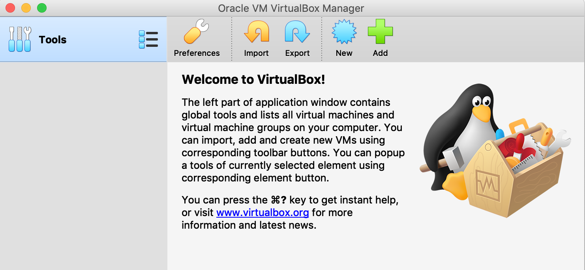

# Network OS Administration 
### __Duaration:__  6 Hours
### __Scope__
- Native Installation and Simulation with Window Linux Subsystem
- User command: file/directory management, Text processing
- Privileged command: Disk Management, User management, Permission, Process Management

### __Task 1__ System Preparaion
1. Download installer file 
  - Virtual Box ([download](https://www.virtualbox.org/wiki/Downloads))
  - Linux ISO file : ubuntu-18.10-live-server-amd64.iso  ([download](http://mirrors.psu.ac.th/pub/ubuntu-releases/18.10/))
1. Install Virtual Box via wizard untill all step are completed.
<br/><br/>
1. xxx


### __Task 2__ Create VM with Virtual Box

### __Task 3__ Ubuntu Installation

### __Task 4__ Enable Window Linux Subsystem

### __Task 5__ User Command: File Management
```console
foo@bar:~$ whoami
foo
```


### __Task 6__ User Command: Directory Management

### __Task 7__ Text Processing

### __Task 8__ Privileged Command: Disk Management 

### __Task 9__ Privileged Command: User management

### __Task 10__ Privileged Command: Permession

### __Task 11__ Privileged Command: Process Management


